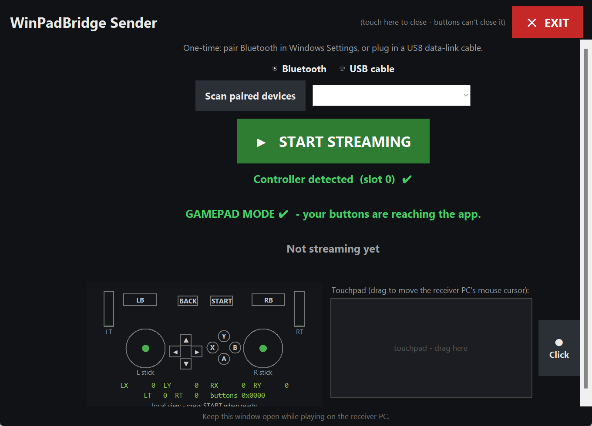
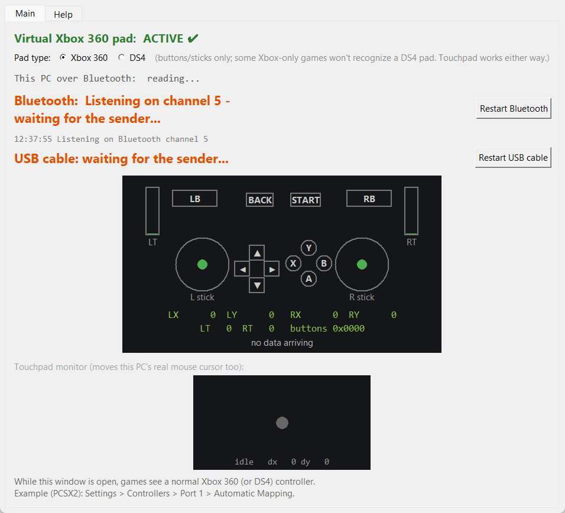

<div align="center">

# WinPadBridge

**Turn any Windows handheld into a wireless controller (and trackpad) for another PC.**

[](#requirements)
[](#requirements)
[](#license)
[](#project-background)

ROG Ally · Legion Go · GPD Win · AYANEO · or any Windows handheld with a built-in gamepad

</div>

---

Two Windows PCs can't plug a controller into each other directly — neither
one can "pretend" to be a USB peripheral. WinPadBridge works around that by
streaming the handheld's gamepad state to the other PC over Bluetooth or a
USB data-link cable, where it becomes a real virtual Xbox 360 (or DS4)
controller that any game can use — plus a touchpad that drives the PC's
actual mouse cursor.

No installer, no drivers to hunt down beyond one official one, no command
line required day-to-day — both apps are plain windowed Python programs.

## Screenshots

<table>
<tr>
<td width="50%" align="center"><b>Sender</b> — runs on the handheld</td>
<td width="50%" align="center"><b>Receiver</b> — runs on the PC</td>
</tr>
<tr>
<td></td>
<td></td>
</tr>
</table>

## How it works

```
Handheld                                      PC
built-in gamepad (XInput)                     virtual Xbox 360 / DS4 pad (ViGEmBus)
        |                                             ^
sender_gui.pyw  --  Bluetooth or USB cable  -->  receiver_gui.pyw  --> any game
        |                                             |
   touchpad drag                              moves the real mouse cursor
```

Two connection methods, selectable in the sender's UI:

- **Bluetooth** (default) — pair the two devices once in Windows
  Settings, no network required, unaffected by firewalls.
- **USB cable** — needs a USB-C **data-link/bridge cable** (a
  "PC-to-PC transfer cable"), not a plain charging cable. Windows turns
  it into a small virtual network adapter; the app auto-discovers the
  receiver PC over it, so no manual IP entry is needed.

Both use a lightweight custom handshake/streaming protocol (not a
standard HID/gamepad Bluetooth profile), since a Windows PC cannot
natively act as a Bluetooth gamepad peripheral.

## Requirements

**Receiver PC:**
- Windows 10/11, Python 3.11+
- [ViGEmBus driver](https://github.com/nefarius/ViGEmBus/releases) (one-time install — creates the virtual controller)
- `pip install vgamepad` (the receiver can also install this for you from its own UI)

**Handheld (sender):**
- Windows 10/11 (or Windows-based handheld OS), Python 3.11+
- No extra packages — standard library only

## Running it

1. **Receiver PC:** open `receiver_gui.pyw`. It listens on both Bluetooth
   and USB cable at the same time.
2. **Handheld:** make sure the controls are in **Gamepad mode**, not
   Desktop/Mouse mode (Command Center button, Armoury Crate, or your
   device's equivalent → Control Mode → Gamepad). In Desktop mode the
   sticks act as a mouse and won't be seen as gamepad input by any app.
3. Open `sender_gui.pyw`, pick Bluetooth or USB cable, press **Start**.
4. Once connected, open any game →
   Settings → Controllers → Automatic Mapping → pick the Xbox 360
   controller (example: PCSX2).

Both apps include a live controller-test view and step-by-step help
built into the UI, so most setup issues are diagnosed on-screen.

## Touchpad (mouse control)

The sender has a drag rectangle plus a click button. Dragging it moves
the receiver PC's **real Windows mouse cursor** directly — like a
laptop trackpad — completely independent of the virtual gamepad. It
works no matter which Pad type is selected, since it's a plain cursor
move/click, not part of the controller's HID report.

The receiver's Main tab has a "Touchpad monitor" box: a dot that walks
around by the same drag deltas being sent to the cursor, so you can
confirm packets are arriving even when you can't see the real cursor
(e.g. it's off in a game window).

## Pad type (Xbox 360 / DS4)

The receiver can emulate either an **Xbox 360** controller (default,
broadest game compatibility) or a **DS4** (DualShock 4) controller.
This only affects buttons/sticks/triggers — some games only recognize
Xbox-style input and won't see a DS4 pad at all, so only switch to DS4
if a game specifically expects a PlayStation-style controller.

## Project background

Built iteratively through real hands-on debugging: starting from a
terminal-only prototype, through a GUI rebuild, discovering the
Desktop/Mouse-mode trap on Windows handhelds, adding Bluetooth after
Wi-Fi/firewall issues, fixing a Bluetooth-constant naming bug
(`AF_BTH` vs `AF_BLUETOOTH`), fixing a bufferbloat latency bug from an
over-aggressive send rate, adding the USB cable option as an
alternative to Bluetooth, and adding the touchpad-to-mouse feature.

## License

MIT — do whatever you like with it.

## Disclaimer

This project only *reads* controller input and streams it as data; it
does not modify system security settings. Use official drivers
(ViGEmBus) from their original source.
